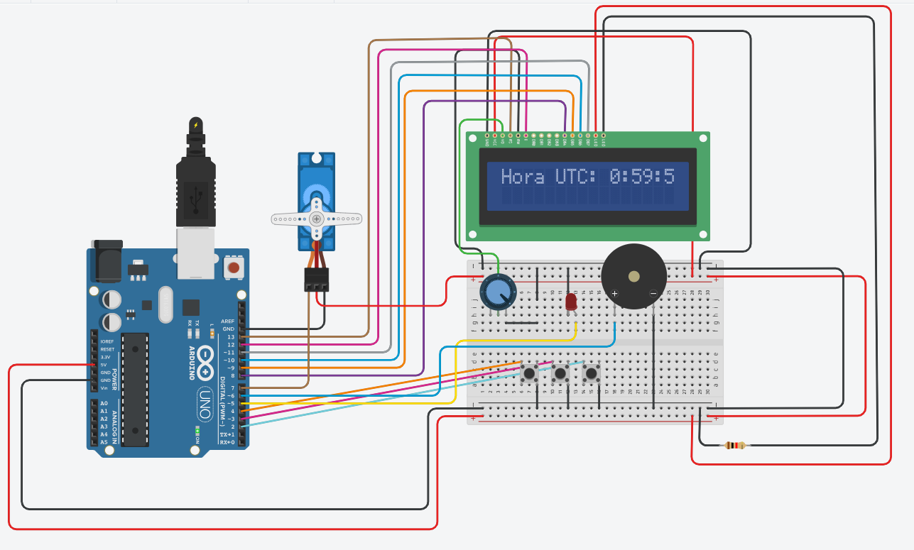
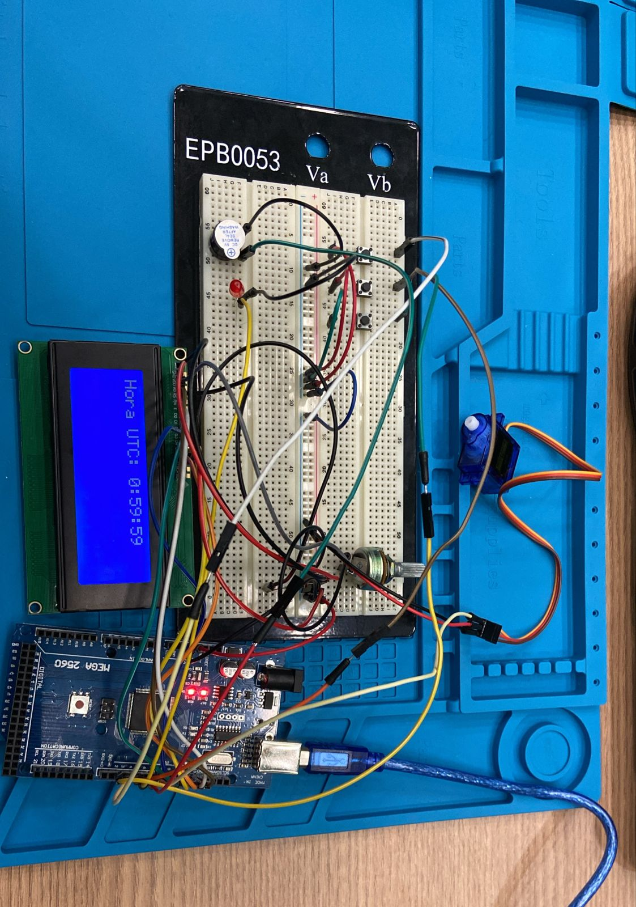

# Plano e Casos de Teste para o Projeto Dispenser de Remédio

## 1. Introdução

### Objetivo:
Este documento define o plano de teste e os casos de teste para o projeto Dispenser de Remédio, com o intuito de verificar a funcionalidade, desempenho, segurança e confiabilidade do sistema IoT implementado.

### Escopo:
Os testes cobrem os principais componentes e funcionalidades do sistema, incluindo o controle do servo motor, integração de botões, LEDs e buzzer, além da lógica de cronograma implementada no Arduino Mega.

## 2. Estratégia de Teste

### Metodologia:
A metodologia utilizada será baseada em testes manuais, com foco em testes funcionais, de integração e de usabilidade.

### Ambiente de Teste:
- **Dispositivos**: Arduino Mega, Servo Motor, LEDs, Buzzer, Botões.
- **Ferramentas**: Arduino IDE para programação e Tinkercad para simulação e validação.
- **Responsáveis pelo Teste**: Equipe técnica do projeto ou testadores designados.

## 3. Casos de Teste

### Caso de Teste 1: Controle do Servo Motor
- **ID**: CT-001
- **Descrição**: Verificar se o servo motor gira corretamente para liberar uma pílula quando acionado.
- **Pré-condição**: O servo motor está corretamente conectado ao Arduino Mega e configurado no código.
  
#### Passos de Teste:
1. Alimentar o Arduino Mega e inicializar o sistema.
2. Pressionar o botão para simular o acionamento manual.
3. Observar o movimento do servo motor para verificar se ocorre corretamente.

- **Resultado Esperado**: O servo motor deve girar até a posição configurada e retornar à posição inicial.
- **Resultado Real**: Servo motor apresentou o resultado esperado.
- **Status**: Passou.

---

### Caso de Teste 2: Notificações Visuais e Sonoras
- **ID**: CT-002
- **Descrição**: Verificar se os LEDs e o buzzer indicam corretamente os estados do sistema.
- **Pré-condição**: LEDs e buzzer estão conectados e configurados no código.

#### Passos de Teste:
1. Configurar o cronograma no Arduino para disparar o alarme.
2. Esperar pelo horário programado.
3. Observar o comportamento dos LEDs e do buzzer.

- **Resultado Esperado**: O LED vermelho acende e o buzzer emite um som contínuo quando chega ao horário programado.
- **Resultado Real**: O LED e o buzzer realizaram suas funções. 
- **Status**: Passou.

---

### Caso de Teste 3: Configuração do Cronograma
- **ID**: CT-003
- **Descrição**: Validar se o sistema respeita o cronograma configurado.
- **Pré-condição**: Configurar o cronograma usando os botões de set e mudar horário.

#### Passos de Teste:
1. Alimentar o Arduino Mega.
2. Aguardar o intervalo configurado.
3. Observar a ativação do servo motor, LEDs e buzzer nos horários previstos.

- **Resultado Esperado**: O sistema ativa os componentes exatamente nos horários configurados.
- **Resultado Real**: O sistema atinge o esperado com base no cronograma configurado.
- **Status**: Passou.

---

## 4. Critérios de Aprovação

- **Funcionalidade**: Todos os casos de teste funcionais devem ser aprovados.
- **Desempenho**: O sistema deve responder em tempo real (máximo de 4 segundo de atraso).
- **Resiliência**: O sistema deve retomar as operações após falhas sem perda de dados críticos.

## 5. Fotos do Circuito
- **Circuito TinkerCad**:
  
  
  
- **Montagem do Circuito**:
  
  
  
## 6. Conclusão

### Resumo dos Resultados:
Após a execução dos testes definidos no plano, os seguintes resultados foram obtidos:

- **Caso de Teste 1: Controle do Servo Motor**
  - Resultado: Passou. O servo motor operou conforme esperado, liberando uma pílula de maneira consistente e retornando à posição inicial.
  
- **Caso de Teste 2: Notificações Visuais e Sonoras**
  - Resultado: Passou. O LED e o buzzer indicaram corretamente os estados do sistema, com o LED verde acendendo e o buzzer emitindo um alerta sonoro no momento certo.
  
- **Caso de Teste 3: Configuração do Cronograma**
  - Resultado: Passou. O sistema ativou o servo motor nos intervalos programados, demonstrando precisão no controle de tempo.
  
**Resumo Geral**: Todos os casos de teste foram concluídos com sucesso, demonstrando que o sistema Dispenser de Remédio está funcional, confiável e alinhado com os requisitos propostos.

### Recomendações
  
- **Testes de Longa Duração**: Realizar testes estendidos para avaliar a durabilidade dos componentes e o desempenho do sistema em condições de uso contínuo.
  
- **Feedback do Usuário**: Considerar um módulo de feedback com som ou mensagem para confirmar que a pílula foi dispensada corretamente, evitando possíveis dúvidas do usuário.

Estas recomendações visam garantir maior confiabilidade, usabilidade e funcionalidade do sistema, além de facilitar futuras expansões ou adaptações.
